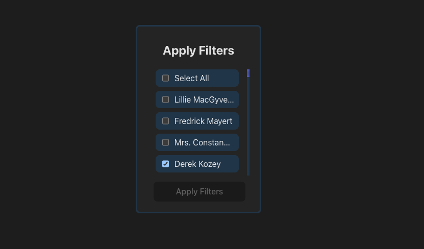
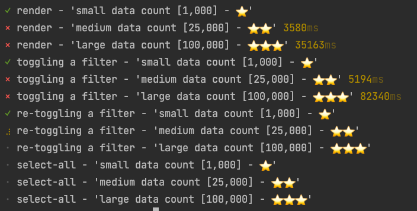
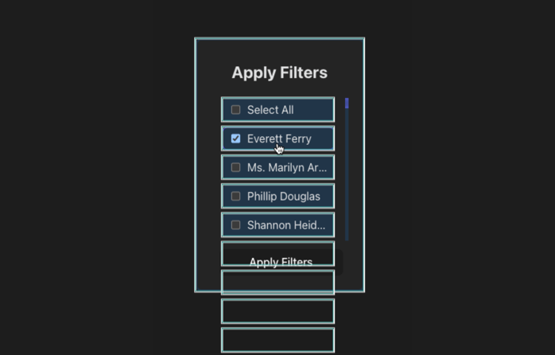
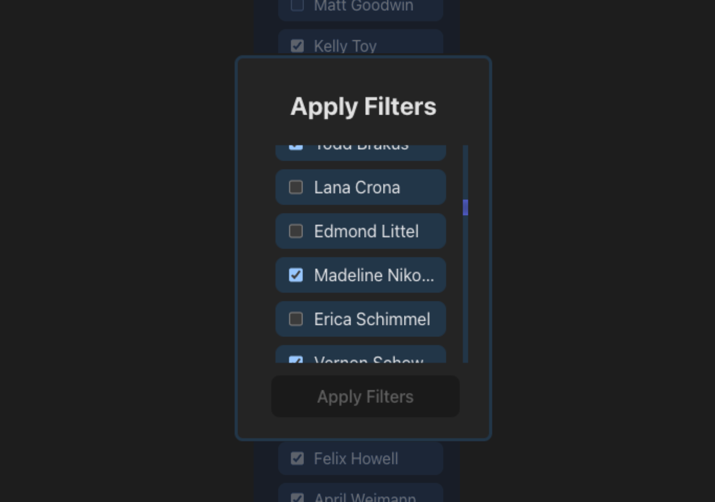

# Filters Are A Mess
A performance improvement exercise everyone should try.

## The Story
They told me to compose a filter component.
These were their **requirements**:
- Present given filters + their statuses (checked / unchecked).
- Filter statuses can be changed on the user session.
- Filters are applied once apply button is clicked.
- Apply button should be disabled if no pending changes.
- Enable “Select All” functionality for quick selection.

And so I've developed the filter component. Everything went well, it was rolled out as planned, and our customers were happy!

But than came this huge customer, and ruined it all! My bulletproof filter component failed, and my boss wasn't happy :(

I gave it a go, how hard could it be?
The things I've learned when solving the different issues that came up has put me in perspective on what I know about performance.

## The Exercise
Given my perfectly fine \<FiltersComponent />, find a way to turn it scalable, and support larger amounts of data.
Make sure to make any product decisions by your own. The component should look and behave exactly the same from the end-user's perspective.

### Installation
```
git clone git@github.com:poseneror/filters-are-a-mess.git
cd filters-are-a-mess
npm install
```

### Running the project
1. Start project locally - `npm start`
2. Run tests (performance milestones included) - `npm test`


### Goal
Pass as many performance milestones as possible

You can play with the amount of filters drawn by modifying `main.tsx`

### Tips
<details>
    <summary>Sometimes we need to go back to school.</summary>
    Let's re-visit data-structure lectures and try to map big O(n) notations for different operations / calculations we made in the component.
</details>
<details>
    <summary>Parents Suck.</summary>
    <ol>
        <li> A react component re-renders every time its state updates.</li>
        <li> A react component will ALWAYS re-render when its parent re-renders.</li>
    </ol>
    
    <a href="https://react.dev/reference/react/memo#memo">Memoize</a> your components to prevent re-rendering if props don’t change. <br />
    <b>Important:</b> Anonymous functions defined during render cycle have unique references.
</details>
<details>
    <summary>Virtualize Long Lists</summary>
    Official React Docs: <br />
    "If your application renders long lists of data (hundreds or thousands of rows), we recommend using a technique known as “windowing”. This technique only renders a small subset of your rows at any given time, and can dramatically reduce the time it takes to re-render the components as well as the number of DOM nodes created."
    
    There are different ways to virtualize long lists, including infinite scroll, and different pagination methods. But in order to keep the current behavior I found out it's best to use <a href="https://react-window.now.sh/">react-window</a>.
</details>

Feel Free to share your solutions and results!
